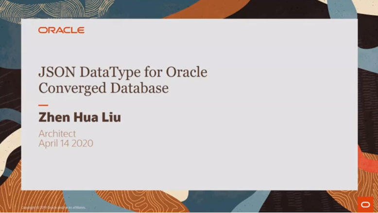

# Workshop Introduction and Overview

## Introduction to Oracle JSON 

JSON(JavaScript Object Notation)is a syntax for storing and exchanging data. When exchanging data between a browser and a server, the data can only be text.

JSON is text, and we can convert any JavaScript object into JSON, and send JSON to the server.We can also convert any JSON received from the server into JavaScript objects.

This way we can work with the data as JavaScript objects, with no complicated parsing and translations.

**JSON with Oracle Database:**

JSON data  can be used in Oracle Database in similar ways. Unlike relational data, it can be stored, indexed, and queried without any need for a schema that defines the data. Oracle Database supports JSON natively with relational database features, including transactions, indexing, declarative querying, and views.

So it's likely we want to send and receive JSON documents from and to our database. And store them in your tables. Oracle Database has a huge amount of functionality that makes this easy.

Oracle database provides a comprehensive implemention of SQL, for both analytics and batch processing. JSON held in the Oracle Database can be directly accessed via SQL, without the need to convert it into an intermediary form. JSON collections can be joined to other JSON collections or to relational tables using standard SQL queries.

**Storing and Managing JSON Documents**

JSON documents can be stored usinga VARCHAR2, CLOB,or BLOB column. An IS JSON SQL constraint ensures that the column contains only valid JSON documents, allowingthe database to understand that the column is being used as a container for JSON documents.

Oracle’s JSON capabilities are focused on providing full support for schemaless development and document-based storage. Developers are free to change the structure of their JSON documents as necessary. With the addition of JSON support, Oracle Database delivers the same degree of flexibility as a NoSQL JSON document store.

The first thing to realize about JSON is that it remains a simple text format—which is relatively easy to read and inspect with the naked eye. At a syntax level, what starts to set JSON apart from other formats is the characters used to separate data, which are mainly constrained to apostrophes ', brackets ( ), [ ], { }, colons :, and commas ,. This listing illustrates what a JSON payload looks like:

 **Watch the video below for an overview of Oracle JSON**

  
  

  

- [I have a Freetier or Oracle Cloud account](https://oracle.github.io/learning-library/data-management-library/database/multitenant/freetier/index.html)
- [I have an account from SSWorkshop](https://oracle.github.io/learning-library/data-management-library/database/multitenant/ssworkshop/index.html)

## Get an Oracle Cloud Trial Account for Free!
If you don't have an Oracle Cloud account then you can quickly and easily sign up for a free trial account that provides:
-	$300 of freee credits good for up to 3500 hours of Oracle Cloud usage
-	Credits can be used on all eligible Cloud Platform and Infrastructure services for the next 30 days
-	Your credit card will only be used for verification purposes and will not be charged unless you 'Upgrade to Paid' in My Services

Click here to request your trial account: [https://www.oracle.com/cloud/free](https://www.oracle.com/cloud/free)

 

## Acknowledgements

- **Authors/Contributors** - Arvind Bhope,Venkata Bandaru,Ashish Kumar,Priya Dhuriya , Maniselvan K.

- **Last Updated By/Date** - Laxmi A, kanika Sharma May 2020

- **Workshop Expiration Date**

### Issues?
Please submit an issue on our [issues](https://github.com/oracle/learning-library/issues) page. We review it regularly.

