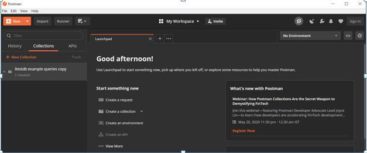
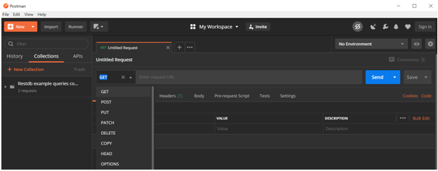
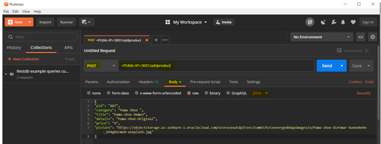
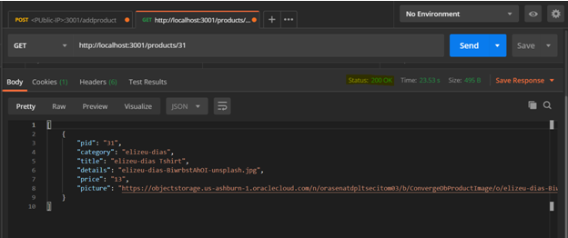
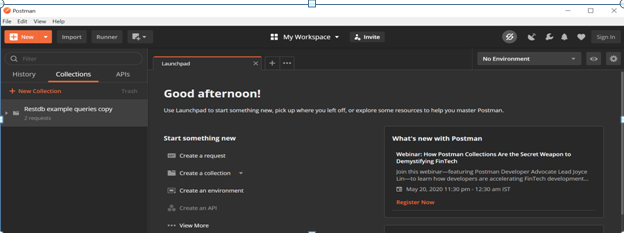
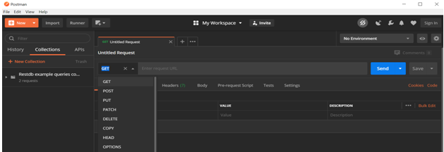
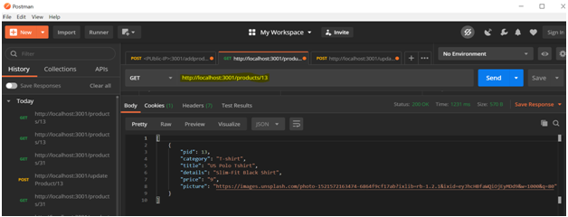

# Oracle Node.js  
  
   
**Overview**: - 

**About REST architecture: -** 

REST stands for Representational State Transfer. REST is web standards based architecture and uses HTTP Protocol. It revolves around resource where every component is a resource and a resource is accessed by a common interface using HTTP standard methods. REST was first introduced by Roy Fielding in 2000.

A REST Server simply provides access to resources and REST client accesses and modifies the resources using HTTP protocol. Here each resource is identified by URIs/ global IDs. REST uses various representation to represent a resource like text, JSON, XML but JSON is the most popular one.

**HTTP methods**

Following four HTTP methods are commonly used in REST based architecture.
-	**GET** − This is used to provide a read only access to a resource.
-	**PUT** − This is used to create a new resource.
-	**DELETE** − This is used to remove a resource.
-	**POST** − This is used to update an existing resource or create a new resource.


**RESTful Web Services**

A web service is a collection of open protocols and standards used for exchanging data between applications or systems. Software applications written in various programming languages and running on various platforms can use web services to exchange data over computer networks like the Internet in a manner similar to inter-process communication on a single computer. This interoperability (e.g., communication between Java and Python, or Windows and Linux applications) is due to the use of open standards.

Web services based on REST Architecture are known as RESTful web services. These web services uses HTTP methods to implement the concept of REST architecture. A RESTful web service usually defines a URI, Uniform Resource Identifier a service, which provides resource representation such as JSON and set of HTTP Methods.

**Before You Begin**

This lab walks you through the steps to use Application API to add , view and update the product details in database by using RestAPI.

**What Do You Need?**

-	Postman should be installed on your local system. Please use the below link to download the postman if you have not downloaded yet.
https://www.postman.com/downloads/


## Steps:

1. Add the Product details in JSON format into Oracle database by using HTTP POST method. 

   a.	Launch the Postman
        
  

   b.	Open a new workspace.
  
   
   
  c.	Select POST Method and enter the request URL
           
        
   ````
    <copy>
    Method: - POST
    URL: - <PUBLIC-IP>:3001/addproduct
    Format: - Body and JSON(check the image below attached)
	  Product details: - Example
		{
   "pid": "488",
   "category": "Puma Shoe ",
   "title": "Puma-shoe Demo3",
   "details": "Puma-shoe-Original",
   "price": "9",
   "picture": "https://objectstorage.us-ashburn-1.oraclecloud.com/n/orasenatdpltsecitom03/b/ConvergedbAppImage3/o/Puma-shoe-dietmar-hannebohn-_G94gB2cms0-unsplash.jpg"
   }
  
      </copy>
  ````    
  
  
  
  d. Click on Submit, Postman return the HTTP 200 after successfully added product in oracle database.


2. Verify the product details added into oracle database by using HTTP GET method.
    
    a.	Launch the Postman.

    b.	Open a new workspace

    c.	Select GET Method and enter the request URL

    ````
    <copy>
    Method: - GET
    To get list of all the product details
    URL: - <Public-IP>:3001/products
    To get the specific product details by using PID.
    URL: - <Public-IP>:3001/products/<PID>

      </copy>
    ````
     
    
   
    

    d.	Open any browser and verify the above result.

    

3. To UPDATE the product details by using HTTP UPDATE Method. 
    
    a.	Launch the Postman.

      

    b.	Open a new workspace.
       
      

    c.	Before update, Please check the product details format by using GET Method.
 
     

      We are going to update the price from 9$ to 12$ for the product PID=13.

      Check the key value format for the price field.

			{“Key”: “value”}
		
    	   {"price": "9"}
   
    d. Select POST Method and enter the request URL to update the price value for the PID=13
  	Method: - POST

    URL: - <PUBLIC-IP>:3001/updateProduct/13
    Format: - Body and JSON (check the image below attached)
		Product details: - Example
		
    
           {“Key”: “value”}
		   {"price": "12"}

     
    

   
        
4. Verify the Updated product details by using HTTP GETmethod.  
    
    

   

See an issue?  Please open up a request [here](https://github.com/oracle/learning-library/issues).        