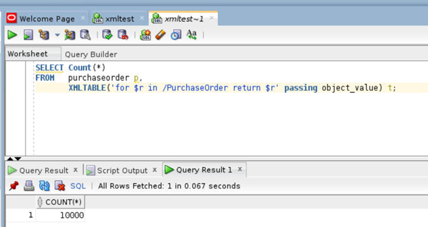
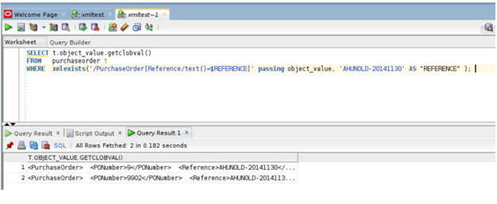

# Oracle XML 

 

## Steps:#

**Querying XML Content**
 
1. Login to PDB: Below are the details
   
     ````
    <copy>

   Username: appxml
   Password: Oracle_4U
   PDB name: pdbjxl
   PORT: 1530
    </copy>
    ````

2. Getting the number of XML documents. There are many ways, following is one of them
   
       ````
        <copy>
       SELECT Count(*)FROM   purchaseorder p,  XMLTABLE('for $r in /PurchaseOrder return $r' passing object_value) t;    )
        /
       </copy>
    ````

      
     

3. Retrieving the content of an XML document-usingpseudocolumn OBJECT_VALUE

    
    ````
    <copy>
    SELECT t.object_value.getclobval()FROM   purchaseorder t
    WHERE  rownum = 1;  

 
       </copy>
    ````
      
     

4.  Accessing fragments or nodes of an XML document
 
    
    ````
    <copy>
    SELECT Xmlquery('/PurchaseOrder/Reference' passing object_value returning
    content)
    FROM   purchaseorder
    WHERE  ROWNUM<= 5
    /
    
    </copy>
    ````

  

5.  Accessing text node value

    ````
    <copy>
    SELECT xmlcast(xmlquery('$p/PurchaseOrder/Reference/text()' passing object_value AS "p" returning content) AS varchar2(30))
    FROM   purchaseorder
    WHER ROWNUM<= 5
    /

    </copy>
    ````

   
   


6. Searching an xml document
     
    ````
    <copy>
   SELECT t.object_value.getclobval() FROM   purchaseorder t   WHERE  xmlexists('/PurchaseOrder[Reference/text()=$REFERENCE]' 
   passing    object_value, 'AsniHUNOLD-20141130' AS "REFERENCE" ); )
       /
       
       </copy>
    ````
    
    
    
    
    
  
 
        
